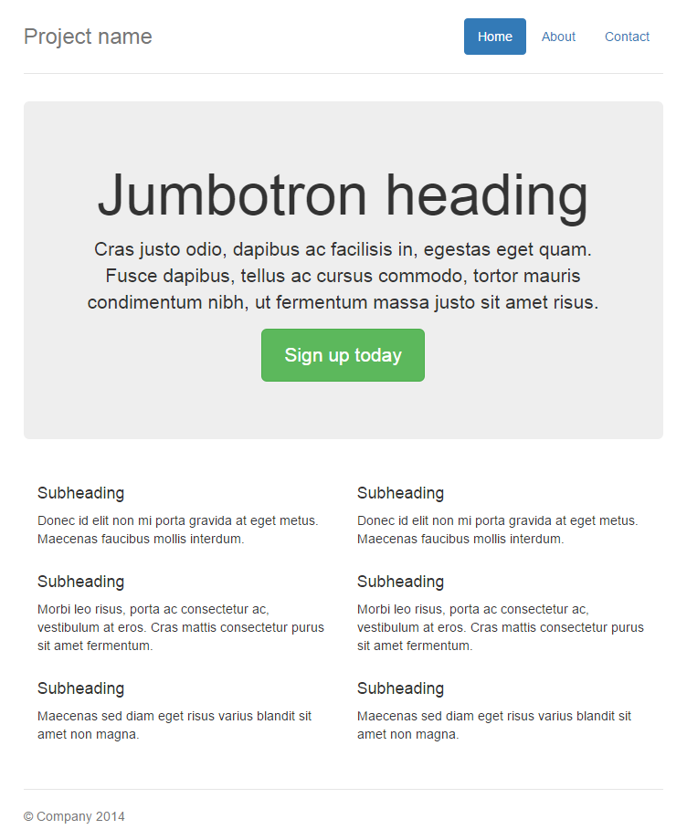
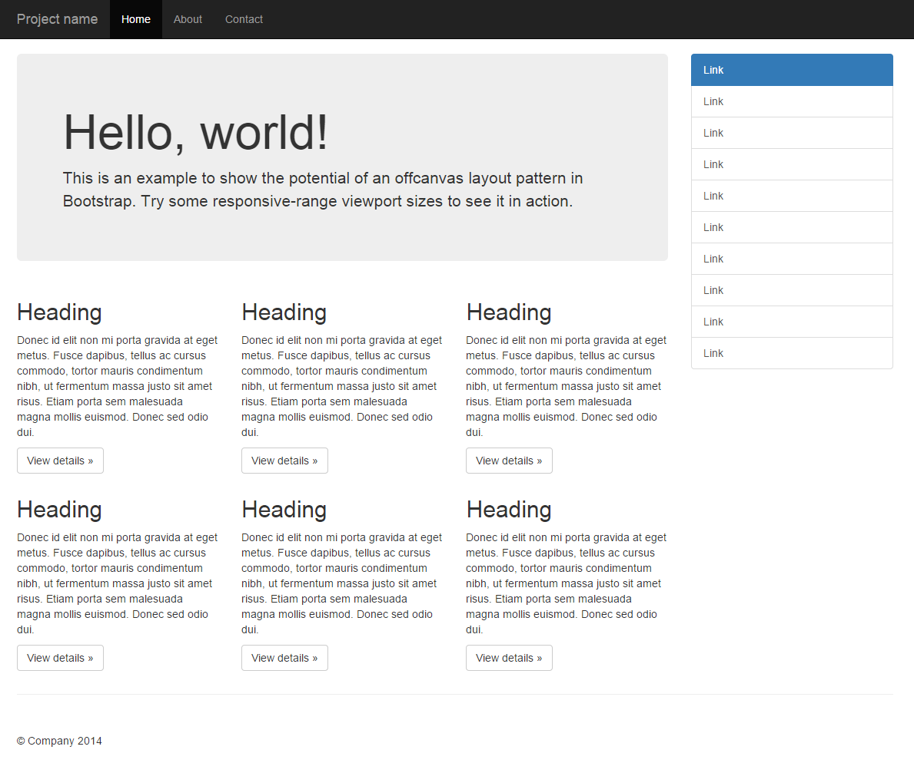

#Introduction to Bootstrap

##Why We Care
- Advanced layout doesn't have to mean hard layout.
- Most of the difficult work done with layout is done using frameworks.
- Frameworks remove many burdens to frontend development including generic grids, mobile responsiveness via media queries, and starter UI elements.

##Grid Refresher
- Grids are the standard way of laying out content on the web.
- Most grid systems operate on a 12-column grid.
- Grid sizes can be thought of in terms of grid place offsets. For example, two blocks of content next to each other is two columns of 6. 4 across is an offset of 3.
- Grid offset numbers must add up to 12.

##Twitter Bootstrap
- Bootstrap is a front-end framework that incorporates a grid system, UI components, JavaScript widgets and more.
- The framework consists of one main CSS file, an optional theme CSS file, and a main JS file.
- Bootstrap requires jQuery to work, which is a JavaScript framework.

##Using Bootstrap
- To use Bootstrap you have to include the three required files.
- Bootstrap files can be linked via the CDN provided, or downloaded locally onto the computer.
- Remember to place your reference to the jQuery library above your reference to the Boostrap JS code.

##Bootstrap Columns
- Columns are written in this format as a class attribute: col-(breakpoint)-(offset).
- An example of a three-column layout may be to use the class col-sm-4.
- All columns should be wrapped into an element with a class of row.
- So the complete three-column layout may look something like this:

```
<div class="row">
	<div class="col-sm-4">
		Content Here
	</div>
	<div class="col-sm-4">
		Content Here
	</div>
	<div class="col-sm-4">
		Content Here
	</div>
</div>
```

##Breakpoints
- The way that Bootstrap works is to dynamically reduce column size according to the window size.
- To be mobile-friendly, the columns will break into a stack layout after a minimum width is detected.
- The breakpoints you can select in your columns control at which point this happens.

##CSS3 Media Queries
- Media queries allow you to apply and remove CSS styling based on the screen dimensions.
- This is important to create truly mobile-friendly layouts.
- To use it you have to specify screen resolution thresholds.
- Let's try an example where we want to show a div where the screen size is larger than 700 pixels:

HTML

```
<div id="my-div"></div>
```

CSS

```
@media(min-width: 700px) {
	#my-div {
		width:400px;
		height:400px;
		border:#000 1px solid;
	}
}
```

- Now where the screen size is below 700 pixels:

CSS

```
@media(max-width: 700px) {
	#my-div {
		width:400px;
		height:400px;
		border:#000 1px solid;
	}
}
```

- You can also combine these values to select a range:

```
@media(min-width: 700px) and (max-width: 900px) {
	#my-div {
		width:400px;
		height:400px;
		border:#000 1px solid;
	}
}
```

- Good news! Bootstrap does this for you!

##Code-Along
- Let's see the grid system in action.
- We will be coding the Bootstrap grid example:


- Let's also make sure to practice using different breakpoints.

##UI Elements
- Bootstrap wraps in a myriad of great UI elements that you can drop in anywhere on your site.
- With Bootstrap you can make really pretty things quickly.

##Putting it Together
- We will be coding along a simple Bootstrap template that will help you practice the grid system.
- Also think about which UI components may be present.



##Do It Yourself: Another Bootstrap Template
- On your own try to look through this mockup and code it from scratch yourself.
- Before you start, think about how the grid system will be implemented, and how the page should be put together.

